# AURA Spatial Tracker Architecture

## Product Goal

AURA is a spatial inventory app. The core idea is a physicalized filesystem:

Room -> Furniture -> Compartments/Drawers -> Containers/Items

The user wants a smartphone-friendly 3D room/workshop view that feels like a holographic building survey: dark background, transparent cyan structures, readable outlines, stable CAD-like navigation, clean snapping, and later calibrated furniture assets with movable drawers/doors.

## Current Workspace

```mermaid
graph TD
  App[apps/desktop-viewer] --> Engine[packages/engine-3d]
  App --> Store[packages/state-store]

  subgraph apps/desktop-viewer
    AppShell[App.tsx]
    UIPanels[components/UIPanels.tsx]
    AssetWorkspace[components/AssetWorkspace.tsx]
    CSS[index.css]
  end

  subgraph packages/engine-3d
    Scene[SceneManager.tsx]
    Camera[components/IsometricCamera.tsx]
    ViewCube[components/ChamferedViewCube.tsx]
    Cabinet[components/ParametricCabinet.tsx]
    Shelf[components/LoadedShelf.tsx]
    Walls[components/HologramWall.tsx]
    Beam[components/IBeam.tsx]
    Guides[components/AlignmentGuides.tsx]
    Footprints[components/SnapFootprints.tsx]
    Geometry[furnitureGeometry.ts]
  end

  subgraph packages/state-store
    Zustand[store.ts]
    Types[types.ts]
    Theme[hologramTheme.ts]
    AssetFiles[assetFileStore.ts]
  end

  Scene --> Cabinet
  Scene --> Shelf
  Scene --> Walls
  Scene --> Beam
  Scene --> Guides
  Scene --> Footprints
  Scene --> Geometry
  Cabinet --> Theme
  AssetWorkspace --> Theme
  Geometry --> Zustand
```



## Important Architecture Decisions

- Canvas navigation is a priority. Camera/pan/zoom behavior must remain deterministic and mobile-friendly.
- ViewCube replaces older Top/Front/Iso buttons.
- The room grid is currently removed. The floor plane is the depth reference.
- Shadows were removed because they were too costly for mobile.
- Furniture snapping must use shared geometry definitions, not renderer-specific guesses.
- Asset calibration is a separate workspace, not a cramped tab in the room panel.
- Imported 3D files should become AURA assets through stored source files plus AURA metadata.
- AURA should avoid unrestricted color picking. Visual roles use curated hologram palettes/swatches.

## Current Runtime Modes

### Room Workspace

`App.tsx` renders the normal three-column layout:

- Left panel: search, furniture catalog, button to open Assets workspace.
- Center: R3F room canvas, camera controls, floor/grid, SceneManager, ViewCube.
- Right panel: selected furniture inspector.

### Asset Calibrator Workspace

`AssetWorkspace.tsx` renders a separate full-window workspace:

- Left: searchable asset list.
- Center: isolated preview canvas for the selected asset.
- Right: categorized editor with Setup, Bounds, Parts, Look.

## Hologram Visual System

Defined in `packages/state-store/src/hologramTheme.ts`.

Current hierarchy:

- Background: near black.
- Building/walls: lightest cyan fill and bright cyan-white outline.
- Furniture body: darker cyan/teal fill and cyan outline.
- Inner parts/drawers: darker contrasting rose/teal layer and bright inner outline.
- Selection: white.
- Snap/alignment: pink/red.
- Collision/debug: green.

Do not add arbitrary free color picking without a strong reason. Use curated swatches.

## Asset Pipeline Direction

Preferred final asset structure:

```txt
model.glb
model.aura.json
```

GLB holds visual model data. AURA metadata holds app meaning:

- footprint
- collision boxes
- snap points
- material roles
- movable parts
- drawer/door motion rules
- container bounds

Supported import strategy:

- First-class runtime target: `.glb` / `.gltf`
- Current direct import support: `.glb`, `.gltf`, `.fbx`, `.obj`, `.stl`
- Imported file blobs are persisted in IndexedDB via `packages/state-store/src/assetFileStore.ts`
- Imported asset definitions store `sourceStorageKey`, `sourceUnitScale`, and `sourceModelOffset`
- Fusion/CAD-style FBX/OBJ/STL files with very large raw bounds are normalized from millimeters to AURA feet
- Future multi-file package support is needed for OBJ/MTL/textures and external GLTF `.bin`/texture references

Rule for movable furniture:

- If a drawer/door is a separate mesh/node, AURA can animate it.
- If the model is merged into one mesh, it can still become static furniture but not reliably movable without manual mesh editing.

## Custom ViewCube Direction

The current ViewCube interaction should stay code-owned. A future custom Fusion-made ViewCube model can be used as the visual shell, but clickable face/edge/corner behavior should remain explicit in code.

Recommended model authoring:

- Separate named parts for body, faces, edges, and corners.
- FBX is acceptable from Fusion 360; GLB is preferred if produced later.
- Assign AURA colors by part name in code rather than trusting authoring-material colors.

## Verification

Use:

```bash
pnpm --filter desktop-viewer lint
pnpm --filter desktop-viewer build
```

On this Windows sandbox, `vite build` often fails inside sandbox with `spawn EPERM`; rerun the same build with escalation. Passing build currently still emits only the known large-bundle warning.
