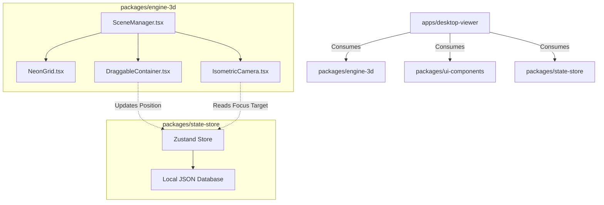

# AURA Spatial Tracker Architecture

```mermaid
graph TD
    %% Main Application
    App[apps/desktop-viewer] --> |Consumes| Engine3D[packages/engine-3d]
    App --> |Consumes| UI[packages/ui-components]
    App --> |Consumes| State[packages/state-store]

    %% 3D Engine Package
    subgraph packages/engine-3d
        Grid[NeonGrid.tsx]
        Camera[IsometricCamera.tsx]
        Furniture[DraggableContainer.tsx]
        Scene[SceneManager.tsx]
        
        Scene --> Grid
        Scene --> Camera
        Scene --> Furniture
    end

    %% State Package
    subgraph packages/state-store
        DB[Local JSON Database]
        Zustand[Zustand Store]
        
        Zustand --> DB
    end

    %% Interactions
    Furniture -.-> |Updates Position| Zustand
    Camera -.-> |Reads Focus Target| Zustand
```