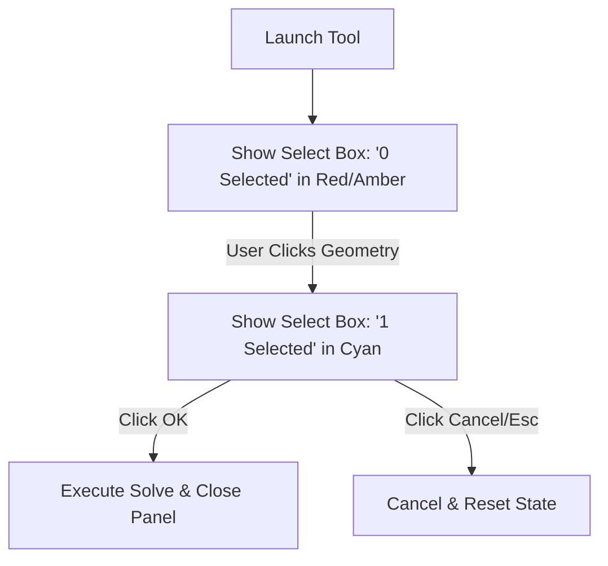

# AURA CAD: Floating Dialog & Selection Panel Blueprint
*(Inspired by Autodesk Fusion 360's Contextual Command Panels)*

This blueprint defines the layout, state flow, and visual structure of the **Floating Contextual Command Panels** (dialog boxes) for AURA's building CAD mode. 

Instead of showing static inputs in a sidebar, commands like drawing, extruding, or filleting spawn a compact floating panel on the **right side of the screen** that updates dynamically depending on the current task and mouse selections.

---

## 1. Floating Dialog Design Rules

```
+-------------------------------------------------------------------+
|  Viewport (Main View)                                             |
|                                                                   |
|  [ViewCube - Top Right]                                           |
|                                                                   |
|                                            +-------------------+  |
|                                            |  COMMAND PANEL    |  |
|                                            |  (e.g., EXTRUDE)  |  |
|                                            +-------------------+  |
|                                            | [Select Profile]  |  |
|                                            | [Height: 10 ft]   |  |
|                                            | [Taper: 0 deg]    |  |
|                                            |                   |  |
|                                            |  [OK]   [Cancel]  |  |
|                                            +-------------------+  |
|                                                                   |
+-------------------------------------------------------------------+
```

### Visual Specifications
*   **Anchor Location**: Floating on the right edge of the 3D viewport canvas.
*   **Styles**: Dark-themed translucent background (`rgba(15, 23, 42, 0.9)`), clean cyan outline (`#06b6d4`), and minimal drop-shadow.
*   **Header**: Displays the active tool name (e.g. `EXTRUDE` or `RECTANGLE`) with a close icon `X` to cancel.
*   **Footer**: Contains two main actions: `OK` (or hit **Enter**) and `Cancel` (or hit **Esc**).

---

## 2. Tool-Specific Dialog Layouts

### I. The Line Tool Dialog
When drawing lines:
*   **Input 1: Length**: A number input showing active length (defaults to active dragging length).
*   **Input 2: Angle**: A degree input locked to the cursor angle.
*   **Status Indicators**: Shows coordinates of the start and end points.

### II. The Rectangle Tool Dialog
When drawing wall slabs or floors:
*   **Mode Selector**: 2-Point Rectangle (default) vs. Center Rectangle.
*   **Input 1: Width**: Dimension value in feet.
*   **Input 2: Height**: Dimension value in feet.
*   *Pressing **Tab** cycles focus between the Width and Height inputs.*

### III. The Circle Tool Dialog
For round columns or floor cutouts:
*   **Input 1: Diameter**: Dimension in feet.
*   **Status**: Center coordinates `[X, Y]`.

### IV. The Extrude Tool Dialog (3D Phase)
When converting sketch boundaries to 3D walls:
*   **Selection Input: Profile**: A button showing "Select profiles" (e.g. `Select profile (1 selected)`). Clicking it highlights sketch boundaries in blue in the viewport.
*   **Input 1: Distance (Height)**: Dimension in feet. Can also be manipulated via an on-screen pull arrow.
*   **Input 2: Taper Angle**: Draft angle for tapered columns/walls.
*   **Operation Selector**: `New Body` (default), `Join` (add to existing slab), or `Cut` (drill a hole/window through a wall).

---

## 3. Dynamic Selection Box Logic

Fusion 360 uses **Select Prompts** that guide users through geometry clicks. Every floating panel implements this state tracker:



### Selection UI States:
1.  **Awaiting Selection**: The target box says `Select` with an amber cursor icon. The canvas shows a hover highlight on valid lines or faces.
2.  **Selected**: The box turns cyan and lists `1 selected` (or the specific ID/name of the curve or body selected).
3.  **Clear Button**: A small `x` next to the selection box allows resetting selections quickly.
